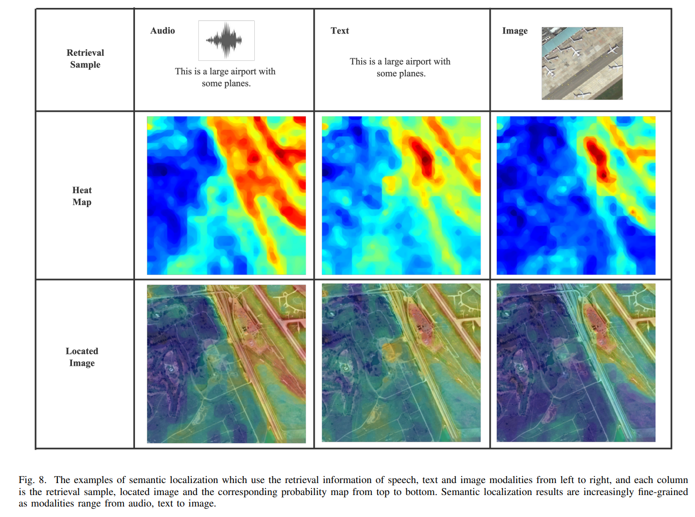

## MCRN: A Multi-source Cross-modal Retrieval Network for Remote Sensing
(undergoing review)

Zhiqiang Yuan, Changyuan Tian, Wenkai Zhang, Yongqiang Mao, Hongqi Wang, and Xian Sun.

### Welcome :+1:_<big>`Fork and Star`</big>_:+1:, then we'll let you know when we update

### -------------------------------------------------------------------------------------
## INTRODUCTION

This paper proposes a multi-source cross-modal retrieval network for remote sensing based on contrastive learning and generative adversarial networks. 
The designed model establishes a shared feature space through modal entanglement and multimodal shared encoding, which in turn yields a common representation of multiple information sources at the semantic level. 
To cope with the lack of annotation data in the RS scene, we construct a unified unimodal self-supervised pretraining method, utilizing a large amount of unlabeled data for pre-training to obtain modal-unbound robust parameters.
We also construct a multisource multimodal RS dataset to promote RSCR task, and utilize the constructed RS multimodal sample pairs to alignment semantics under different modalities based on the multitask learning.




## IMPLEMENTATION

```bash
Installation

We recommended the following dependencies:
Python 3
PyTorch > 0.3
Numpy
h5py
nltk
yaml
```

```bash
File Structure:
-- checkpoint    # savepath of ckpt and logs

-- data          # soorted anns of four datesets
    -- rsicd_precomp
        -- train_caps.txt     # train anns
        -- train_filename.txt # corresponding imgs
        -- train_audios.txt    # train audio specs, which correspond to caption

        -- test_caps.txt      # test anns
        -- test_filename.txt  # corresponding imgs
        -- test_audios.txt    # test audio specs, which correspond to caption

        -- images             # rsicd images here
    -- rsitmd_precomp
        ...

-- layers        # models define

-- option        # different config for different datasets and models

-- vocab         # vocabs for different datasets

-- seq2vec       # some files about seq2vec
    -- bi_skip.npz
    -- bi_skip.npz.pkl
    -- btable.npy
    -- dictionary.txt
    -- uni_skip.npz
    -- uni_skip.npz.pkl
    -- utable.npy

-- dataloader
    -- data,py   # load data

-- engine.py     # details about train, pretrain and val
-- test.py       # test k-fold answers
-- train.py      # main file
-- utils.py      # some tools
-- vocab.py      # generate vocab

Note:
1. In order to facilitate reproduction, we have provided processed annotations.
2. We prepare some used file::
  (1)[seq2vec (Password:NIST)](https://pan.baidu.com/s/1jz61ZYs8NZflhU_Mm4PbaQ)
  (2)[RSICD images (Password:NIST)](https://pan.baidu.com/s/1lH5m047P9m2IvoZMPsoDsQ)
  (3)[RSITMD images (Password:NIST)](https://github.com/xiaoyuan1996/AMFMN/tree/master/RSITMD)
  (4)[Audio mel-spectrums for above two datasets (Password:NIST)](https://pan.baidu.com/s/11jWm8mhZs04cSYpTi5FtCA)
```


```bash
Run: (We take the dataset RSITMD as an example)
Step1:
    Put the images of different datasets in ./data/{dataset}_precomp/images/

    --data
        --rsitmd_precomp
        -- train_caps.txt     # train anns
        -- train_filename.txt # corresponding imgs
        -- test_caps.txt      # test anns
        -- test_filename.txt  # corresponding imgs
        -- images             # images here
            --img1.jpg
            --img2.jpg
            ...
        -- audio_specs        # audios here
            --1.jpg
            --2.jpg
            ...

Step2:
    Modify the corresponding yaml in ./option.

    Regard RSITMD_AMFMN.yaml as opt, which you need to change is:
        opt['dataset']['audio_path']  # change to audio_specs path
        opt['dataset']['image_path']  # change to image path
        opt['model']['seq2vec']['dir_st'] # some files about seq2vec

Step3:
    Bash the ./sh in ./exec.
    Note the GPU define in specific .sh file.

    cd exec
    bash run_rsitmd_wo_pretrain.sh

Note: We use k-fold verity to do a fair compare. Other details please see the code itself.
```

## Citation
If you feel this code helpful or use this code or dataset, please cite it as
```
Z. Yuan et al., "MCRN: A Multi-source Cross-modal Retrieval Network for Remote Sensing," undergoing review.

Z. Yuan et al., "Learning to Evaluate Performance of Multi-modal Semantic Localization," in IEEE Transactions on Geoscience and Remote Sensing, doi: 10.1109/TGRS.2022.3207171.

Z. Yuan et al., "Remote Sensing Cross-Modal Text-Image Retrieval Based on Global and Local Information," in IEEE Transactions on Geoscience and Remote Sensing, doi: 10.1109/TGRS.2022.3163706.

Z. Yuan et al., "A Lightweight Multi-scale Crossmodal Text-Image Retrieval Method In Remote Sensing," in IEEE Transactions on Geoscience and Remote Sensing, doi: 10.1109/TGRS.2021.3124252.

Z. Yuan et al., "Exploring a Fine-Grained Multiscale Method for Cross-Modal Remote Sensing Image Retrieval," in IEEE Transactions on Geoscience and Remote Sensing, doi: 10.1109/TGRS.2021.3078451.
```
